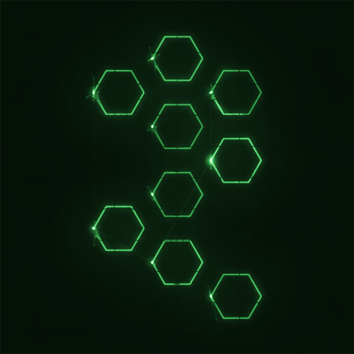

# Hex⬡scope

Generate stereo audio for an XY oscilloscope from SVG polygons, so you can visually display shapes on a scope or in software (or online tools).

This project was inspired by and uses sample **Hexag⬡ns** ([OpenSea Collection](https://opensea.io/collection/hexagons)) for the SVG files.

## What Is This?

`scripts/svg_to_scope.py` takes an SVG file (with polygonal `<path>`s) and does the following:

1. **Parses** the `<path d="...">` data to extract polygon vertices
2. **Draws** an outline PNG for a quick preview (`output.png`)
3. **Generates** a stereo WAV file (`output.wav`) where the left channel is x(t) and the right channel is y(t). All polygons are "time-multiplexed" into one repeating wave cycle, so on an XY scope you'll see them all at once.

## Installation

1. **Clone** this repo:
   ```bash
   git clone https://github.com/andreidavid/hexoscope.git
   cd hexoscope
   ```

2. Create & activate a virtual environment (optional but recommended):
   ```bash
   python -m venv venv
   source venv/bin/activate  # On Linux/Mac
   # or:
   venv\Scripts\activate     # On Windows
   ```

3. Install dependencies:
   ```bash
   pip install -r requirements.txt
   ```

## Usage

Inside the repo folder:

```bash
python scripts/svg_to_scope.py hexagons-pitations.svg hexagons-pitations.png output.wav \
    --sample_rate 44100 \
    --cycle_samples 2048 \
    --repeats_per_second 30 \
    --duration 5
```

### Parameters:

- `hexagons-pitations.svg`: Your SVG containing polygonal hexagon paths (or any shapes)
- `hexagons-pitations.png`: A quick preview of the polygons (green lines on black)
- `output.wav`: The stereo audio file for XY display
- `--sample_rate`: WAV sample rate. Default is 44100
- `--cycle_samples`: Number of samples in one wave cycle. More samples = higher shape detail
- `--repeats_per_second`: How many times per second we loop the entire shape cycle (like a refresh rate)
- `--duration`: Total time (seconds) for the WAV

## Viewing / Listening

To view the generated `output.wav` in XY mode, you can use:

- A physical oscilloscope with X and Y inputs
- Software like [OsciStudio](https://oscilloscopemusic.com/) or a DAW plugin
- [dood.al/oscilloscope](https://dood.al/oscilloscope) (an online oscilloscope) to drag in the WAV file and see the shapes

You'll see the polygons all appear "together," thanks to time multiplexing and the scope's refresh/persistence.



## License

You may use, modify, or distribute this code under the terms of the MIT License, unless noted otherwise.